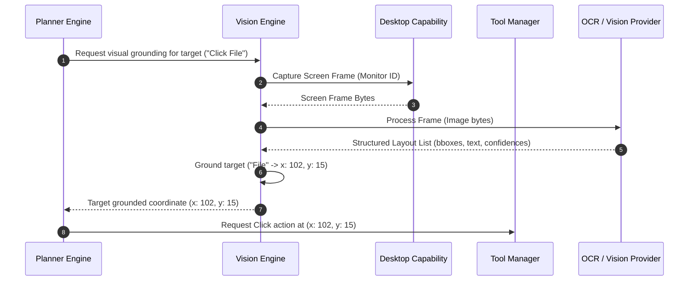

# Vision Capability Design Review
## Evaluation of Vision & OCR Capability Pack (NOVA-CAP-VIS v1.0)

---

| Field | Value |
|---|---|
| **Document ID** | NOVA-ARR-004 |
| **Version** | 1.0 |
| **Status** | `UNDER REVIEW` |
| **Author** | Antigravity (Lead Software Engineering Agent) |
| **Reviewer** | ChatGPT (Chief Architect) |
| **Approved By** | Praveen (Project Founder) |
| **Created** | 2026-06-28 |
| **Last Updated** | 2026-06-28 |
| **Dependencies** | NOVA-CAP-VIS-001 to NOVA-CAP-VIS-008 |

---

## Revision History

| Version | Date | Author | Summary of Changes |
|---|---|---|---|
| 1.0 | 2026-06-28 | Antigravity | Initial release. Completed design review of the Vision & OCR specs and provider interfaces. |

---

## 1. Executive Summary

This design review evaluates the Vision & OCR Capability specifications (`NOVA_Capability_Pack_5C_Vision_OCR_v1.0`). We analyze completeness, propose standard model abstraction interfaces to support replaceable local/cloud engines, and clarify integration paths between the Planner, Tool Manager, and Desktop systems.

---

## 2. Completeness & Consistency Review

The capability specifications are consistent with the "observe-only" mandate (`NOVA-CAP-VIS-001`):
*   **Decoupling:** The Vision capability only returns metadata observations and bounding coordinates. Direct interaction (clicks, drags) is delegated entirely to the Desktop Capability, preserving architecture boundaries.
*   **Missing Specifications:** We identified a gap in multi-monitor coordinate synchronization. If coordinates are returned as local coordinates for Monitor 2, but the mouse emulator assumes virtual screen primary coordinate maps, clicks will land off-target.
*   **Resolution:** We propose that the Vision Engine must normalize all screen coordinates to a standardized **Virtual Screen Space coordinate map** defined in shared utilities.

---

## 3. Replaceable Provider Abstraction Design

Per **NOVA-ADR-007**, we decouple the platform from proprietary layout engines:

*   **Boundary:** The core `VisionEngine` receives screenshots from the `DesktopCapability` and coordinates execution.
*   **Decoupling:** Concrete layout recognizers (Tesseract, PaddleOCR, local ONNX engines, external LLM vision API connectors) implement standard abstract interfaces:
    *   `IOCRProvider` for character-extraction logic.
    *   `IVisionModelProvider` for visual object grounding.
*   **Benefits:** Decouples core logic from heavy third-party framework loads (like PaddlePaddle or OpenCV wrappers).

---

## 4. Subsystem Integration Flow



---

## 5. Security, Performance & Privacy Policies

*   **Privacy (Zero-Persistence):** Screen capture buffers must exist only in-memory (represented as Python `bytes` or `io.BytesIO` objects) and never write to the filesystem unless diagnostic screenshot logging is explicitly enabled.
*   **Sensitive Information Masking:** Vision systems must match extracted text bounding boxes against a regex list of sensitive labels (e.g., matching standard credit card shapes or password strings) and mask coordinates in runtime workspace memory when requested by security policy.
*   **Performance Cache Loop:** OCR processing is CPU/GPU heavy. The system should maintain a local **Visual layout cache** that matches active layout coordinates against a hashing of the screenshot. If screen pixels are unchanged within a 500ms window, the system bypasses provider execution.

---

## 6. Testing Strategy

*   **OCR Mock Testing:** Check extraction logic using synthetic screen layouts containing standard controls (buttons, input boxes).
*   **Scaling and DPI Testing:** Assert that coordinates scale correctly when screen parameters change (e.g., testing standard 96 DPI coordinate outputs vs. high-density Windows 150% scaling targets).
```
