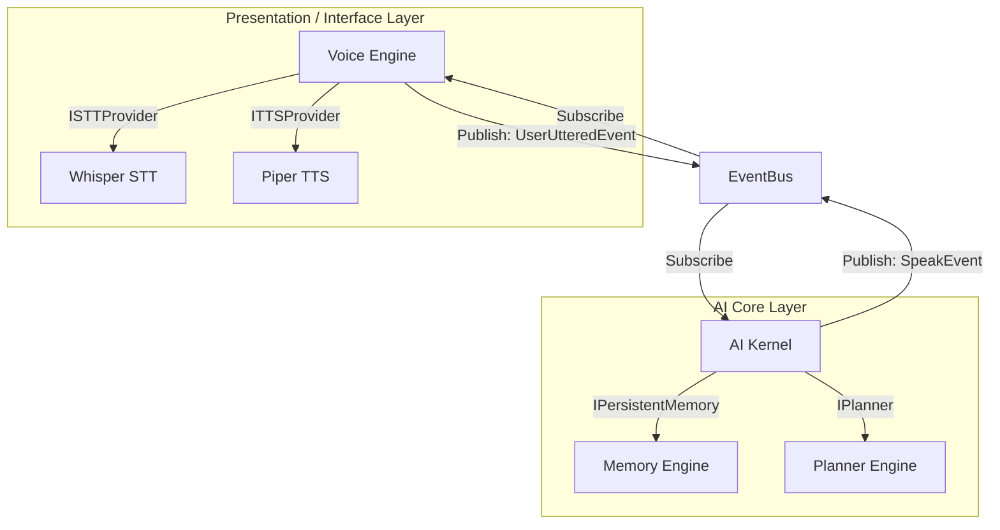

# Voice Capability Design Review
## Evaluation of Voice & Conversation Capability Pack (NOVA-CAP-VOI v1.0)

---

| Field | Value |
|---|---|
| **Document ID** | NOVA-ARR-005 |
| **Version** | 1.0 |
| **Status** | `UNDER REVIEW` |
| **Author** | Antigravity (Lead Software Engineering Agent) |
| **Reviewer** | ChatGPT (Chief Architect) |
| **Approved By** | Praveen (Project Founder) |
| **Created** | 2026-06-28 |
| **Last Updated** | 2026-06-28 |
| **Dependencies** | NOVA-CAP-VOI-001 to NOVA-CAP-VOI-008 |

---

## Revision History

| Version | Date | Author | Summary of Changes |
|---|---|---|---|
| 1.0 | 2026-06-28 | Antigravity | Initial release. Completed design review of the Voice & Conversation specs and provider interfaces. |

---

## 1. Executive Summary

This design review evaluates the Voice & Conversation Capability specifications (`NOVA_Capability_Pack_5D_Voice_v1.0`). We analyze completeness, propose standard abstractions for replaceable Speech-to-Text (STT) and Text-to-Speech (TTS) engines, define sub-system interface bounds, and evaluate critical latency, privacy, and interruption scenarios.

---

## 2. Completeness & Consistency Review

The capability specifications are consistent with the presentation layer bounds (`NOVA-CAP-VOI-001`):
*   **Separation of Concerns:** The voice capability is correctly limited to transforming spoken language to text tokens and vice-versa. Natural language understanding and action planning are delegated entirely to the `AIKernel` and `PlannerEngine`.
*   **Missing Specifications:** We identified a gap in audio interruption detection. If NOVA is speaking a long response, and the user starts speaking (interruption), the system must immediately stop the audio output device and process the new speech input.
*   **Resolution:** The voice capability must monitor the microphone input stream concurrently during speaker playback and trigger a `PlaybackInterrupted` event if incoming volume thresholds are exceeded.

---

## 3. Replaceable Provider Abstraction Design

Per **NOVA-ADR-008**, we decouple the platform from audio libraries by introducing the `ISTTProvider` and `ITTSProvider` interfaces:

*   **Boundary:** The core `VoiceEngine` manages active microphone recording hooks and speaker hardware.
*   **Decoupling:** Framework-specific scripts (e.g. local Whisper weights, local Piper text synthesis pipelines, cloud Azure API connections) implement the providers' methods.
*   **Benefits:** Decouples core logic from audio drivers, allowing offline Vosk execution when offline, and cloud Azure Speech models when low-latency premium voices are required.

---

## 4. Subsystem Interface Boundaries



*   **Handoff Sequence:**
    1.  The `VoiceEngine` transcribes input and publishes a `UserUttered` event containing the raw text to the `EventBus`.
    2.  The `AIKernel` catches the event, queries short-term conversational context from `MemoryEngine`, and forwards it to the `PlannerEngine`.
    3.  When a plan is completed or requires a confirmation query, the `AIKernel` publishes a `Speak` event to the `EventBus`, which the `VoiceEngine` captures to synthesize audio via the `ITTSProvider`.

---

## 5. Latency, Privacy & Interruption Evaluations

### A. Latency Optimization
To achieve conversational responses, the target latency from user utterance end to first synthesized audio token must be under **1.2 seconds**.
*   *Mitigation:* The `ISTTProvider` must implement **streaming transcription** (chunk-by-chunk processing) rather than waiting for complete silence. The `Planner` can start processing intent classifications before the user finishes speaking the final words.

### B. User Privacy Safeguards
To comply with the Constitution (`NOVA-002`), continuous listening is restricted:
*   *Control:* The microphone is active only if explicit wake-word listening is enabled, or during a push-to-talk Session window.
*   *Visibility:* The UI must display a prominent, hardware-independent visual recording indicator (e.g., a tray icon or floating glowing ring) whenever the microphone channel is open.

### C. Interruption Handling
*   If a `UserSpeaking` event is triggered during synthesis playback, the `VoiceEngine` must call an immediate `.stop()` function on the output audio device driver, discard the remaining text buffer, and switch to recording mode.
```
