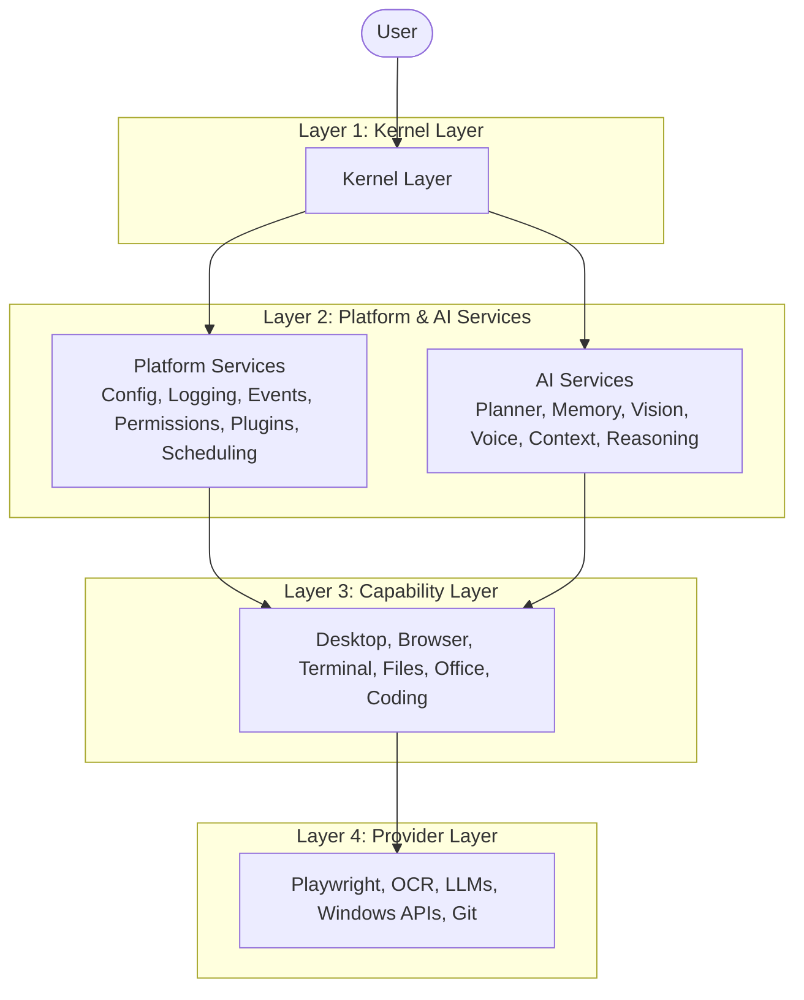

# System Architecture Specification
## Project NOVA High-Level Architecture, Component Layering, and Interface Contracts

---

| Field | Value |
|---|---|
| **Document ID** | NOVA-SPEC-003 |
| **Version** | 1.0 |
| **Status** | `APPROVED` |
| **Author** | Antigravity (Lead Software Engineering Agent) |
| **Reviewer** | ChatGPT (Chief Architect) |
| **Approved By** | Praveen (Project Founder) |
| **Created** | 2026-06-28 |
| **Last Updated** | 2026-06-28 |
| **Dependencies** | NOVA-SPEC-001, NOVA-SPEC-002 |

---

## Revision History

| Version | Date | Author | Summary of Changes |
|---|---|---|---|
| 1.0 | 2026-06-28 | Antigravity | Consolidate Component Architecture, Data Flow, Event Flow, High-Level Design, Low-Level Design, and Interface Specification drafts. |

---

## Table of Contents
1. [Purpose & Scope](#purpose--scope)
2. [Component Layering Model](#component-layering-model)
3. [High-Level System Design](#high-level-system-design)
4. [Data & Execution Flows](#data--execution-flows)
5. [Event-Driven Flow Model](#event-driven-flow-model)
6. [Global Subsystem Interface contracts](#global-subsystem-interface-contracts)
7. [Low-Level Engine Index](#low-level-engine-index)

---

## Purpose & Scope

This specification defines the system architecture, component relationships, data processing sequences, and interface boundaries for Project NOVA. It binds all subsystem designs to strict interface boundaries and decoupled communications, ensuring the platform remains modular and extensible.

---

## Component Layering Model

NOVA is structured as a complete **Operating Platform** rather than a feature collection. The macro-architecture is organized into four strict foundational layers:



### Layer Definitions

1.  **Kernel Layer:** The central orchestrator handling startup, shutdown, loop ticks, and subsystem synchronization.
2.  **Services Layer (Platform & AI):** 
    *   *Platform Services:* System-level utilities for Configuration, Logging, Event Bus (Pub/Sub), Permissions, Plugins, and Scheduling.
    *   *AI Services:* Cognitive reasoning tools including Planners, Memory indexing, Context management, Vision, and Voice processing.
3.  **Capability Layer:** High-level APIs mapping real-world environments to programmatic controls (e.g. Desktop GUI abstraction, Terminal emulation).
4.  **Provider Layer:** Third-party integrations (Whisper APIs, OpenAI, local Tesseract models, Playwright) hidden behind generic interface adapters.

*Rule:* Every layer must depend exclusively on abstract interface definitions. Direct instantiation of concrete third-party providers from the Capabilities layer is prohibited.

---

## High-Level System Design

The system coordinates intent processing through the following layout path:

```
User Intent (Input Layer)
       ↓
  AI Orchestrator (core)
       ↓
  Planner Engine (engines) <---> Context Engine (engines)
       ↓
  Permission Engine (core)
       ↓
  Tool Manager (core)
    ├── Windows Adapter (tools)
    ├── Browser Adapter (tools)
    └── Terminal Adapter (tools)
       ↓
  Execution Engine (engines) ---> Observation Engine (engines) ---> Memory Engine (engines)
       ↓
Response Layer
```

---

## Data & Execution Flows

Every intent transaction follows this synchronous lifecycle:

1.  **Input:** Spoken audio or text query is received.
2.  **Context Builder:** Gathers active window metadata, clipboard, process lists, and history.
3.  **Planner:** Evaluates the intent and context to output a structured execution plan.
4.  **Memory Lookup:** Resolves target variables, parameters, or configurations.
5.  **Permission Check:** Enforces safety policy validations against the generated plan tasks.
6.  **Tool Selection:** Resolves execution adapters required for tasks.
7.  **Execution:** Invokes OS adapters to perform action primitives (clicking, typing).
8.  **Observation:** Scans display coordinates or page state to verify outcomes.
9.  **Memory Update:** Saves task states and context histories.
10. **Output:** Synthesizes final text or speech responses.

---

## Event-Driven Flow Model

To prevent circular dependency blocks between stateful engines (e.g. Planner importing Memory directly), engines communicate by publishing and subscribing to topics on the core `EventBus`:

```
User Input
    ↓ (Emits: UserUtteredEvent)
Intent Detection
    ↓ (Emits: IntentDetectedEvent)
Planning Engine
    ↓ (Emits: PlanningStartedEvent)
Tool Manager
    ↓ (Emits: ToolSelectedEvent)
Execution Engine
    ↓ (Emits: ActionExecutedEvent)
Observation Engine
    ↓ (Emits: ResultValidatedEvent)
User Response
```

*Traceability:* Every transaction sequence carries a unique `Trace ID` headers to allow cross-system execution tracing.

---

## Global Subsystem Interface Contracts

Subsystems must expose these abstract base interfaces to ensure clean compilation dependency separation:

*   `ISpeechEngine` (Voice)
*   `IVisionEngine` (Vision)
*   `IMemoryEngine` (Memory)
*   `IPlanner` (Planning)
*   `IToolManager` (Tool routing)
*   `IExecutionEngine` (Execution)
*   `IWorkflowEngine` (Routine orchestration)
*   `IContextEngine` (State aggregation - *REQUIRES ARCHITECT REVIEW*)
*   `IPermissionEngine` (Safety validation - *REQUIRES ARCHITECT REVIEW*)

---

## Low-Level Engine Index

The core engine package directory is composed of these stateful modules:
*   `AIOrchestrator`: Starts and stops platform sessions.
*   `Planner`: Compiles natural intentions into structured task blocks.
*   `Memory`: Retrieves and writes semantic and workspace database tables.
*   `Context`: Aggregates active window states and clips.
*   `Voice`: Handles STT streaming and TTS playbacks.
*   `Vision`: Normalizes screenshot outputs and element detections.
*   `ToolManager`: Resolves tools and checks permission grants.
*   `Execution`: Safely runs emulated actions.
*   `Observation`: Evaluates visual displays.
*   `Reflection`: Analyzes execution errors and suggests alternate tasks.
*   `Permission`: Evaluates active safety policies.
*   `Workflow`: Executes pre-configured, persistent routine tasks.
