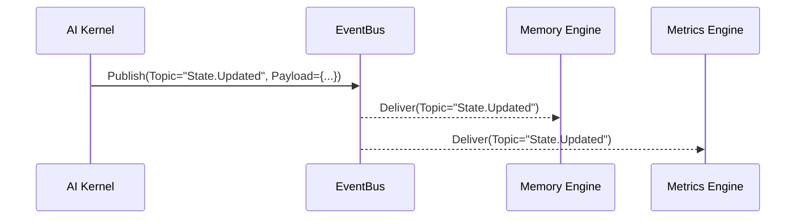
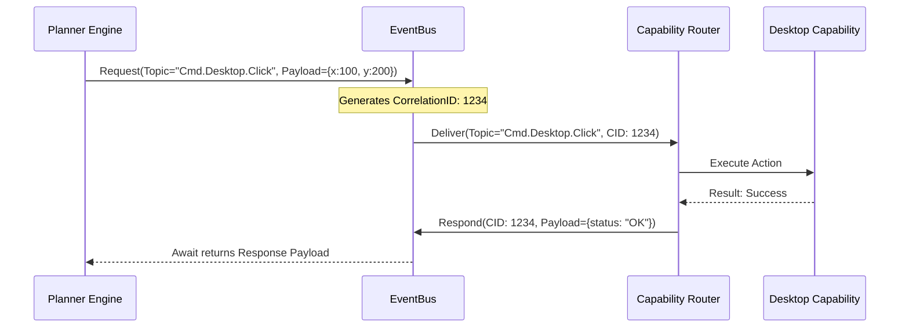
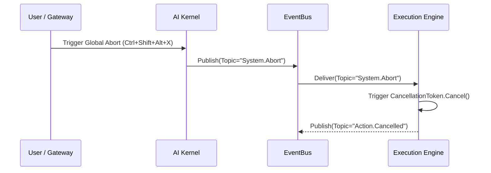
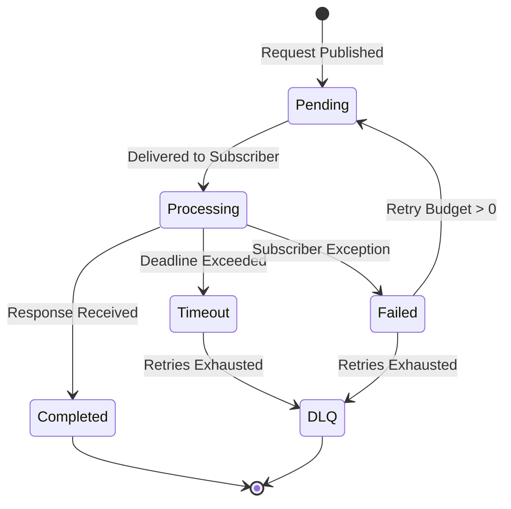

# Communication Framework Specification
## Project NOVA System Subsystem Interconnect Model

---

| Field | Value |
|---|---|
| **Document ID** | NOVA-SPEC-010 |
| **Version** | 1.0 |
| **Status** | `APPROVED` |
| **Author** | Antigravity (Lead Software Engineering Agent) |
| **Reviewer** | ChatGPT (Chief Architect) |
| **Approved By** | Praveen (Project Founder) |
| **Created** | 2026-06-28 |
| **Last Updated** | 2026-06-28 |
| **Dependencies** | NOVA-SPEC-003, NOVA-SPEC-009 |

---

## Revision History

| Version | Date | Author | Summary of Changes |
|---|---|---|---|
| 1.0 | 2026-06-28 | Antigravity | Initial publication defining event flows, async schemas, and IEventBus interfaces. |

---

## Table of Contents
1. [Executive Summary](#executive-summary)
2. [Communication Model Requirements](#communication-model-requirements)
3. [Event Flow & Sequence Diagrams](#event-flow--sequence-diagrams)
4. [Dependency Rules](#dependency-rules)
5. [State Machine & Failure Recovery](#state-machine--failure-recovery)
6. [Public Interfaces](#public-interfaces)
7. [Message Envelope Schema](#message-envelope-schema)
8. [ADR Recommendations](#adr-recommendations)

---

## Executive Summary

The Communication Framework provides the central asynchronous messaging backbone for Project NOVA. It enables loose coupling between the AI Kernel, memory engines, planners, and capabilities (Voice, Vision, Desktop, Browser). By standardizing on an event-driven `IEventBus` model, the system supports both single-node concurrency and future distributed execution architectures.

---

## Communication Model Requirements

The framework satisfies the following core operational requirements:
*   **Loose Coupling:** Engines never instantiate one another directly. All cross-domain communication routes through the Event Bus.
*   **Event-Driven Execution:** Components react to specific topic triggers.
*   **Request/Response & Pub/Sub:** Supports RPC-style blocking calls via correlation IDs, and fire-and-forget broadcasts.
*   **Async Execution & Streaming:** Built natively on asynchronous coroutines, supporting data chunk yielding (e.g., voice transcription streams).
*   **Cancellation & Timeouts:** Tasks can be aborted mid-flight using cancellation tokens.
*   **Observability:** Built-in error propagation, automated DLQ (Dead Letter Queue) routing, logging, metrics, and distributed tracing.

---

## Event Flow & Sequence Diagrams

### Standard Publish/Subscribe Flow


### Request/Response (RPC) Flow


### Cancellation Flow


---

## Dependency Rules

To maintain strict boundaries, the framework enforces these constraints:
1.  **Inversion of Control:** Subsystems (Voice, Vision, Planner, Capabilities) **MUST NOT** import each other. They may only import the `IEventBus` interface and event data schema classes.
2.  **Stateless Routing:** The Event Bus does not hold business logic. It strictly routes messages based on Topic string matching.
3.  **Encapsulation:** Subsystems subscribe to topics during initialization and yield control back to the orchestrator.

---

## State Machine & Failure Recovery

### Timeout & Retry Lifecycle
Messages routed as RPC requests enter a managed state machine:



### Failure Recovery Policies
*   **Transient Failures (Timeouts/Network):** Managed by the Event Bus wrapper. The bus automatically resends the event up to `MaxRetries` (default: 3).
*   **Terminal Failures (Permission Denied/Invalid Payload):** Exception payloads are wrapped in an `ErrorResponse` and routed immediately back to the requesting engine (e.g., back to the Planner for re-planning).
*   **Dead Letter Queue (DLQ):** Unroutable messages, or messages that exhaust their retry budgets, are logged to a DLQ topic for metrics analysis and developer debugging.

---

## Public Interfaces

All underlying implementations must conform to these abstract contracts.

### 1. The Core Event Bus Contract
```python
from abc import ABC, abstractmethod
from typing import Callable, Any, AsyncGenerator

class IEventBus(ABC):
    @abstractmethod
    async def publish(self, topic: str, payload: dict) -> None:
        """Fire and forget broadcast to all subscribers."""
        pass

    @abstractmethod
    async def request(self, topic: str, payload: dict, timeout_sec: float = 30.0) -> dict:
        """Blocking RPC request awaiting a single correlated response."""
        pass

    @abstractmethod
    def subscribe(self, topic: str, handler: Callable[[dict], Any]) -> None:
        """Register a handler for a specific topic."""
        pass

    @abstractmethod
    async def stream(self, topic: str, generator: AsyncGenerator[dict, None]) -> None:
        """Publish a continuous stream of data chunks to a topic."""
        pass
```

### 2. The Cancellation Token
```python
class CancellationToken:
    def __init__(self):
        self.is_cancelled = False
    
    def cancel(self):
        self.is_cancelled = True
        
    def check(self):
        if self.is_cancelled:
            raise ActionCancelledException("Execution aborted by user or system timeout.")
```

---

## Message Envelope Schema

All messages passed through the `IEventBus` must conform to a standardized JSON-serializable envelope schema:

```json
{
  "EventID": "uuid-v4",
  "CorrelationID": "uuid-v4-optional",
  "Topic": "Domain.Action.Target",
  "Source": "EngineName",
  "Timestamp": "ISO-8601",
  "TimeoutMs": 5000,
  "Payload": {
    "key": "value"
  },
  "TraceContext": {
    "span_id": "uuid"
  }
}
```

---

## ADR Recommendations

To solidify the implementation details of this framework, the following Architecture Decision Records (ADRs) are recommended for drafting:

> [!TIP]
> **Suggested ADRs to Draft for Implementation Phase:**

1.  **NOVA-ADR-013: Event Bus Technology Selection**
    *   *Context:* The `IEventBus` needs a concrete implementation.
    *   *Recommendation:* Use Python `asyncio.Queue` and `asyncio.Event` for the V1 single-node release to minimize dependencies, but ensure the `IEventBus` interface is robust enough to swap to `Redis Pub/Sub` or `RabbitMQ` when transitioning to distributed architectures.
2.  **NOVA-ADR-014: Message Serialization Format**
    *   *Context:* Data passed between nodes must be serialized.
    *   *Recommendation:* Standardize on `JSON` (via `pydantic` models) for V1 human-readability and rapid prototyping. Reserve Protobuf/gRPC strictly for high-throughput binary streams (e.g., raw desktop video streaming).
3.  **NOVA-ADR-015: Stream Processing Model**
    *   *Context:* Voice processing and screen observation require continuous data chunks.
    *   *Recommendation:* Use standard `AsyncGenerator` yielding structures for local streams. For distributed capabilities, map these to WebSockets.
