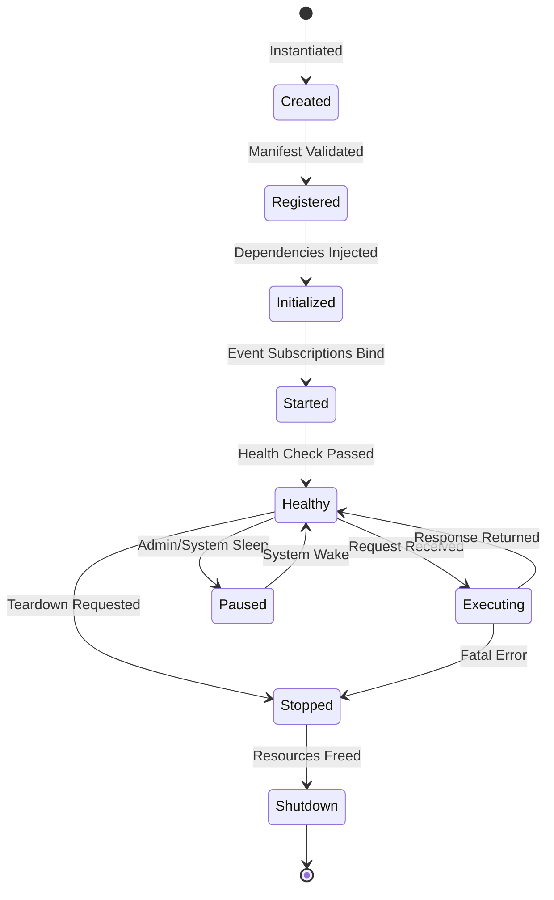
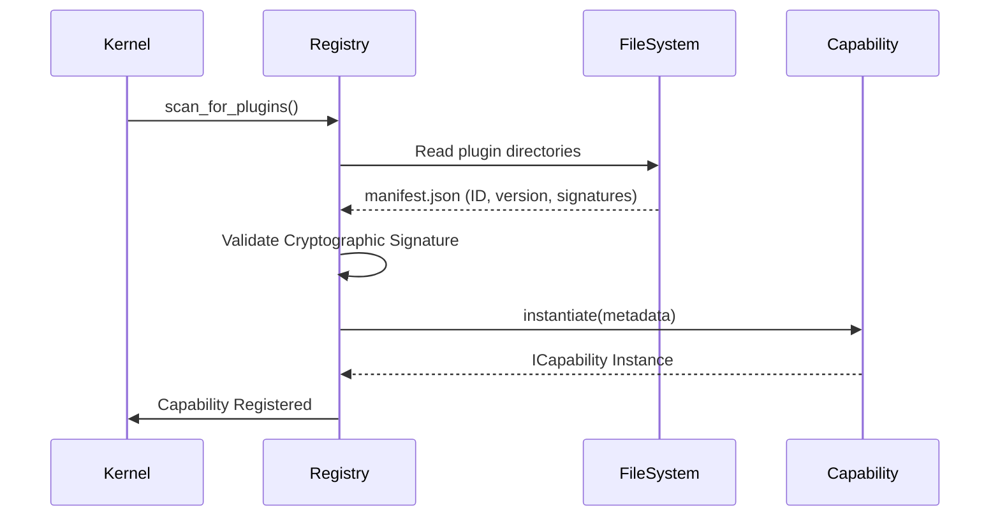
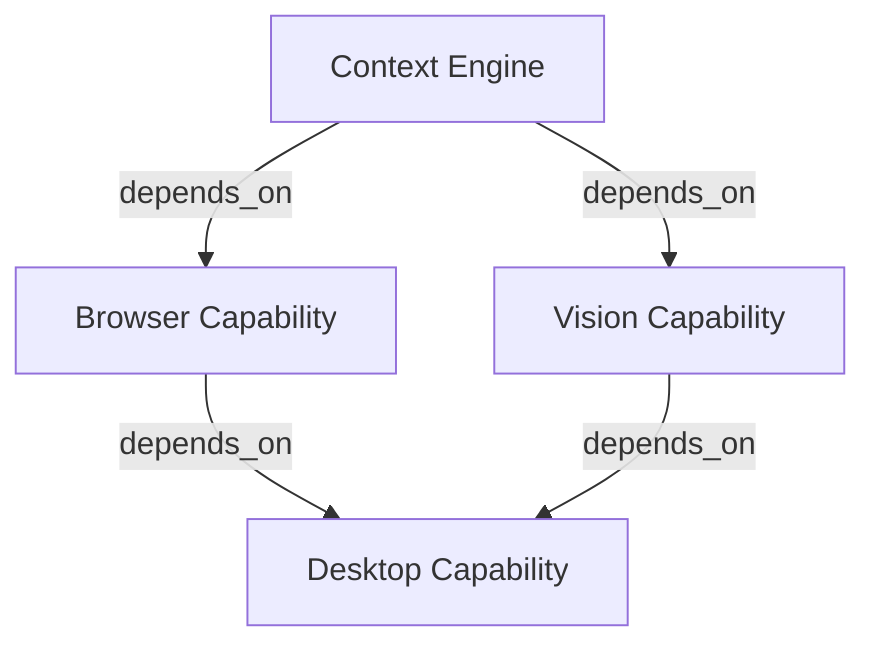
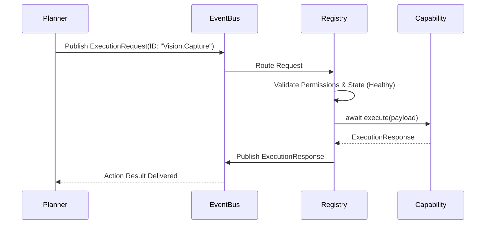

# Project NOVA System Architecture
## Capability Framework Specification

---

| Field | Value |
|---|---|
| **Document ID** | NOVA-SPEC-011 |
| **Version** | 1.0 |
| **Status** | `APPROVED - DESIGN FROZEN` |
| **Owner** | Lead Software Engineer |
| **Dependencies** | NOVA-SPEC-003, NOVA-SPEC-009 |
| **Revision History** | v1.0 Initial Framework Design |

---

## Executive Summary
The Capability Framework is the standardized lifecycle and architectural contract for extending the Project NOVA platform. The Kernel knows nothing about concrete capabilities (e.g., Vision, Desktop, Browser). It interacts exclusively with the abstract `ICapability` interface defined in this document.

---

## 1. Capability Contract
Every capability must strictly adhere to the following responsibilities:
1.  **Isolation:** A capability must encapsulate its own domain. (e.g., Vision Capability does not control the mouse).
2.  **Stateless Execution:** The `execute()` method must be idempotent and stateless where possible. State must be relegated to the Memory Capability.
3.  **Event-Driven:** Capabilities must communicate exclusively via the `IEventBus`. Direct method invocation between capabilities is strictly prohibited.

---

## 2. Capability Lifecycle State Machine
A capability transitions through a rigid state machine managed by the `CapabilityRegistry`.



---

## 3. Registration & Discovery Flow
The Kernel discovers capabilities by parsing `manifest.json` files in the `plugins/` directory.



---

## 4. Dependency Resolution
Capabilities can declare dependencies on other capabilities via their manifest. The Registry performs a Topological Sort to determine the load order.


*Rule: If a dependency fails to reach the `Healthy` state, the dependent capability is aborted.*

---

## 5. Permission Model
Capabilities must declare OS-level permissions in their manifest. The Kernel intercepts execution requests and blocks them if the token lacks the declared scope.

**Example `manifest.json` metadata:**
```json
{
  "permissions_required": [
    "os.fs.read",
    "os.mouse.move",
    "network.https.outbound"
  ]
}
```

---

## 6. Configuration Model
Capabilities define their own strictly typed configuration schemas using `Pydantic`.
The Kernel merges `.env` values and injects the validated `Config` object during the `initialize()` state.

---

## 7. Health Model
The Kernel Watchdog pulses every 10 seconds.
*   Capabilities must implement `async def health_check() -> HealthStatus`.
*   If a capability blocks the thread or returns `UNHEALTHY`, it is transitioned to the `Stopped` state and the Event Bus queues a `System.Capability.Crashed` event.

---

## 8. Execution Sequence Model
When the AI Planner wants to invoke a capability, it dispatches an `ExecutionRequest`.



---

## 9. Error Model
Failures are standardized using the `StructuredError` schema to ensure the AI Reasoning engine can parse and recover from crashes.

```json
{
  "error_code": "ERR_CAP_TIMEOUT",
  "capability_id": "com.nova.vision",
  "message": "OCR engine timed out after 5000ms",
  "recoverable": true,
  "stack_trace": "..."
}
```

---

## 10. Extension Model (Third-Party)
Third-party developers can create plugins by:
1.  Inheriting the Python `ICapability` class.
2.  Providing a valid `manifest.json`.
3.  Dropping the folder into `01_Source/nova/plugins/`.
4.  Restarting the Kernel (Hot-reloading is out of scope for Phase 1).

---

## 11. Review Checklist
- [x] Lifecycles explicitly prevent execution before dependency initialization.
- [x] Capability concrete implementations remain hidden from the Kernel.
- [x] Permission boundaries are strictly enforced prior to execution.
