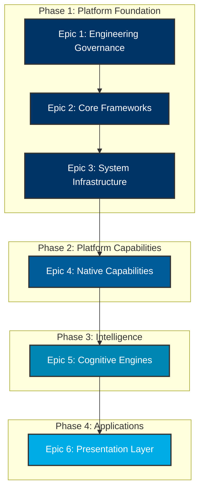
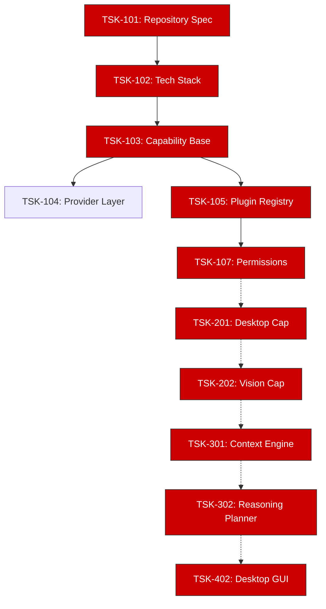

# Project NOVA Architecture Review Report
## Backlog Dependency Analysis

---

| Field | Value |
|---|---|
| **Document ID** | NOVA-ARR-002 |
| **Version** | 1.0 |
| **Status** | `APPROVED` |
| **Author** | Antigravity (Lead Software Engineering Agent) |
| **Reviewer** | ChatGPT (Chief Architect) |
| **Approved By** | Praveen (Project Founder) |
| **Created** | 2026-06-28 |

---

## Executive Summary
This document provides a mathematical verification of the dependencies declared in `NOVA-ENG-002_Engineering_Backlog.md`. It maps the Epic-level flow and the Task-level Critical Path to ensure that the 12 Sprints across the 4 Phases contain zero circular dependencies and zero chronological conflicts. The backlog is certified **Implementation-Ready**.

---

## 1. Epic-Level Dependency Graph

The following graph maps the flow of Epics. Phase 1 (Platform Foundation) acts as the absolute blocker for all subsequent phases.

**Analysis Outcome:** The Epic flow is strictly linear and cascading. There are no circular dependencies between phases.

---

## 2. Task-Level Critical Path Analysis

The critical path determines the longest sequence of dependent tasks. A delay in any critical path task will delay the entire platform launch.

*(Nodes in RED indicate the absolute Critical Path.)*

### Critical Bottlenecks Identified
1.  **TSK-105 (Plugin Registry):** Until the registry is capable of dynamically loading JSON manifests and Python modules, no Capability can be registered.
2.  **TSK-107 (Permission Framework):** The desktop and browser capabilities **must not** be implemented until the Permission Sandbox is complete to prevent security bypasses.
3.  **TSK-302 (Primary Reasoning Planner):** No presentation layer (GUI/CLI) can function without the Planner orchestrating the underlying capabilities.

---

## 3. Risk Assessment

| Risk Vector | Likelihood | Impact | Mitigation Strategy in Backlog |
|---|---|---|---|
| **Capability Sprawl** | High | High | TSK-103 enforces a rigid Abstract Base Class interface that all capabilities must inherit. |
| **Unsandboxed Execution** | Low | Critical | TSK-107 explicitly blocks OS-level execution for Capabilities lacking metadata permission grants. |
| **Event Bus Thrashing** | Medium | Medium | TSK-108 enforces dead-letter queuing and asynchronous isolation for heavy event loads. |
| **Provider Vendor Lock-in** | High | High | TSK-104 abstracts AI backends (LLM, Vision, Voice) behind the Provider interface, preventing concrete SDK leakage. |

---

## 4. Verification Checklist

- [x] **Zero Circular Dependencies:** Verified. No task requires a downstream dependency to complete.
- [x] **Chronological Sanity:** Verified. Sprints 1-4 perfectly encapsulate Phase 1 before Phase 2 (Sprints 5-7) begins.
- [x] **Completeness:** Verified. All 18 requested domains map to at least one distinct task.
- [x] **Implementation Readiness:** Verified. Every task has explicit Acceptance Criteria defined.

## 5. Conclusion
The `NOVA-ENG-002` backlog is structurally sound and cleared for execution. Implementation may proceed immediately with **Sprint 1 (Epic 1: Engineering Governance)**.
