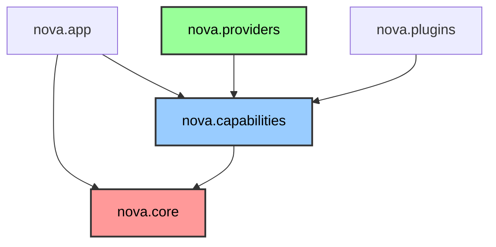

# Project NOVA Official Repository Specification

---

| Field | Value |
|---|---|
| **Document ID** | NOVA-REP-002 |
| **Version** | 1.0 |
| **Status** | `APPROVED` |
| **Owner** | Lead Software Engineer |
| **Dependencies** | NOVA-SPEC-001 |
| **Revision History** | v1.0 Initial Contract |

---

## 1. Purpose and Scope
This document defines the absolute, unyielding structure of the Project NOVA repository. It explicitly details where code belongs, who owns it, how layers interact, and how imports are structured. Any pull request violating these boundaries shall be immediately rejected.

---

## 2. Complete Repository Hierarchy

```text
Project NOVA/
├── 00_Blueprint/               # High-level architecture and specifications (Governance)
├── 01_Source/                  # Main execution code
│   ├── nova/                   # Root Python Package
│   │   ├── core/               # Kernel, DI, Event Bus, Interfaces
│   │   ├── capabilities/       # Abstract capability definitions (Vision, Voice)
│   │   ├── providers/          # Concrete AI/Hardware backend integrations
│   │   ├── plugins/            # Third-party or auxiliary tools
│   │   └── app/                # Application presentation layer (GUI/CLI)
│   └── tests/                  # All unit and integration tests
├── 06_Tools/                   # Developer scripts (Compiler, CI/CD)
├── 99_Archive/                 # Deprecated drafts
├── pyproject.toml              # Strict package dependency file
└── README.md                   # System entrypoint documentation
```

---

## 3. Package Responsibilities

*   **`nova.core`**: The Orchestration Kernel. Owns the Event Bus, Service Locator, Configuration Loader, and the Application Lifecycle. Contains ZERO business logic.
*   **`nova.capabilities`**: The Interface Layer. Owns the standard schemas (`ExecutionRequest`, `CapabilityMetadata`) and Abstract Base Classes for Vision, Voice, Browser, Desktop, etc.
*   **`nova.providers`**: The Implementation Layer. Contains the concrete Python wrappers for external tools (e.g., Playwright, ChromaDB, OpenAI).
*   **`nova.plugins`**: Sandboxed extensions. Evaluated via strict metadata and permission models before execution.
*   **`nova.app`**: The Presentation Layer. Contains PySide6 GUI overlays and the textual CLI.

---

## 4. Layer Boundaries & Dependency Direction

Project NOVA strictly adheres to the **Dependency Inversion Principle (DIP)**.

### Dependency Rules:
1.  **Core is isolated:** `nova.core` MAY NOT import from `capabilities`, `providers`, or `plugins`. It only knows about standard Python primitives.
2.  **Capabilities depend on Core:** `nova.capabilities` MAY import from `nova.core` to utilize the Event Bus and DI containers.
3.  **Providers depend on Capabilities:** `nova.providers` MAY import from `nova.capabilities` to inherit the abstract interfaces. They MUST NOT import other providers.
4.  **Plugins are isolated:** `nova.plugins` MAY import from `nova.core` and `nova.capabilities`, but they execute inside a strictly observed boundary.

### Import Visualization

*(Red nodes have zero outward dependencies. Arrows dictate the allowed direction of imports.)*

---

## 5. Coding & Naming Conventions

*   **Modules/Files:** `snake_case.py` (e.g., `event_bus.py`, `vision_provider.py`).
*   **Classes:** `PascalCase` (e.g., `AsyncioEventBus`, `CapabilityRegistry`).
*   **Interfaces:** Prefixed with `I` (e.g., `ICapability`, `IEventBus`).
*   **Functions/Variables:** `snake_case` (e.g., `dispatch_event`, `max_retries`).
*   **Constants:** `UPPER_SNAKE_CASE` (e.g., `DEFAULT_TIMEOUT_MS`).

### Import Rules
*   **Explicit over Implicit:** Wildcard imports (`from nova.core import *`) are **strictly banned**.
*   **Absolute over Relative:** Absolute imports (`import nova.core.event_bus`) are heavily preferred over relative imports (`from . import event_bus`) to prevent module resolution errors.

---

## 6. Test Organization

Tests do NOT live alongside source code. They are strictly segregated to ensure clean packaging.

*   **Unit Tests:** Must reside in `01_Source/tests/unit/`. They test functions in isolation using mocks.
*   **Integration Tests:** Must reside in `01_Source/tests/integration/`. They test real DB connections and real process boundaries.
*   **Test Naming:** Must mirror the source path. (e.g., `nova/core/di.py` -> `tests/unit/core/test_di.py`).

---

## 7. Future Expansion Policy

When adding new modules (e.g., a new AI Provider):
1.  Define the abstract interface in `nova.capabilities`.
2.  Implement the concrete logic in `nova.providers.[provider_name]`.
3.  Register the provider mapping in `nova.core.di` during boot.
4.  Do NOT inject the new provider explicitly into the core orchestrator.

---

## 8. Acceptance Criteria
*   The `01_Source/nova` package passes a static dependency analysis check confirming no upward dependencies exist (Providers -> Core).
*   The tree structure mirrors this document exactly.
