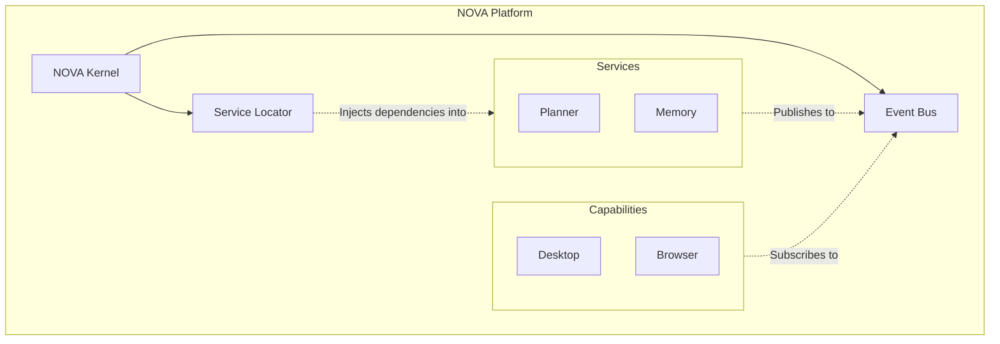
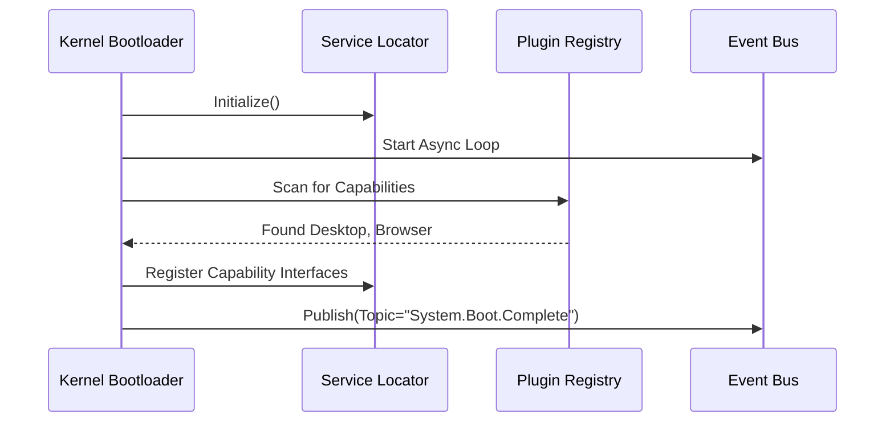
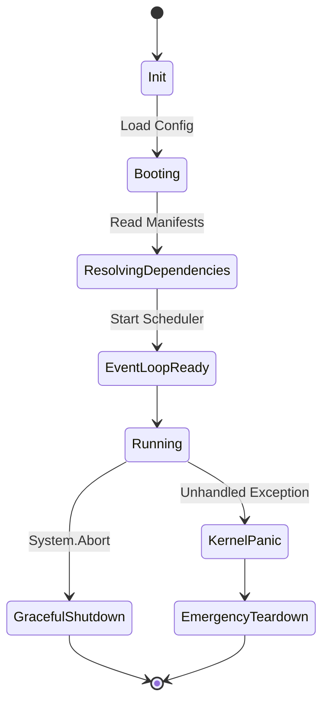
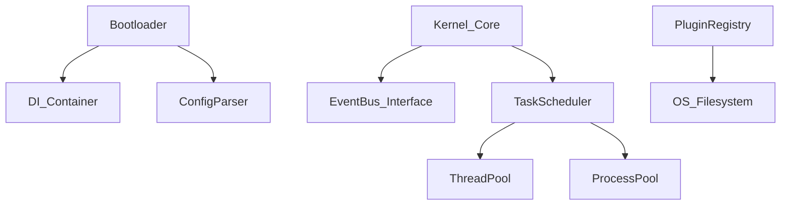

# Official NOVA Kernel Specification
## Project NOVA Core Orchestration Layer (Milestone 2)

---

| Field | Value |
|---|---|
| **Document ID** | NOVA-SPEC-009 |
| **Version** | 3.0 |
| **Status** | `APPROVED - IMPLEMENTATION READY` |
| **Author** | Antigravity (Lead Software Engineering Agent) |
| **Reviewer** | ChatGPT (Chief Architect) |
| **Approved By** | Praveen (Project Founder) |
| **Created** | 2026-06-28 |
| **Dependencies** | NOVA-SPEC-003, NOVA-SPEC-010, NOVA-SPEC-011 |

---

## Executive Summary
This document is the official implementation-ready engineering specification for the NOVA Kernel, the absolute core orchestration layer of Project NOVA. It defines the exact boundaries, lifecycle state machines, and interface contracts that the development team will build against in Milestone 2. 

---

## 1. Purpose
The NOVA Kernel acts as the foundational operating layer of Project NOVA. It provides the isolated, deterministic execution environment for all higher-level Platform Services, AI Services, Capabilities, and Providers. **The Kernel contains absolutely zero AI reasoning or business logic.** Its sole purpose is to boot the system, manage component lifecycles, route events securely, and gracefully terminate the platform.

## 2. Responsibilities
*   **System Bootstrapping:** Safely injecting configurations, loading secrets, and instantiating dependency containers.
*   **Process Orchestration:** Maintaining the primary event loop and prioritizing task queues.
*   **Service Registration:** Dynamically discovering and loading Platform Services, AI Services, and Capabilities into memory without hardcoded dependencies.
*   **Security Enforcement:** Brokering all cross-layer execution requests through the Permission Manager.
*   **Lifecycle Management:** Handling clean startup, session tracking, graceful teardown, and crash recovery.

## 3. Internal Architecture
The Kernel is constructed of four internal foundational blocks:
1.  **Bootloader:** Parses CLI arguments/environment variables and initializes the Service Locator.
2.  **Kernel Context:** The global immutable state object holding reference to the Service Locator and Event Bus.
3.  **Kernel Scheduler:** The core `asyncio` event loop abstraction that manages the thread pools and priority queues.
4.  **Kernel Watchdog:** A background monitor tracking health metrics, memory usage, and thread lockups.

## 4. Kernel Services
The Kernel exposes three primitive services to the Platform Layer:
*   `IServiceLocator`: A strictly typed Dependency Injection (DI) container.
*   `ITaskScheduler`: An abstraction over task yielding, debouncing, and thread-pool offloading.
*   `IPluginRegistry`: A manifest parser and hot-reloader for external Capabilities.

## 5. Session Lifecycle
A Session represents an active, authenticated user context.
*   **Init:** Triggered by `System.Session.Start`. Initializes volatile memory buffers.
*   **Active:** Tracks active context (e.g., current active window, last spoken sentence).
*   **Suspend:** Pauses all non-critical background indexing tasks (e.g., when OS goes to sleep).
*   **Teardown:** Flushes volatile state to persistent storage (Vector DB) and wipes RAM.

## 6. Capability Lifecycle
Capabilities (like Desktop or Browser) undergo a strict lifecycle:
1.  **Discovered:** The `PluginRegistry` scans the `Capabilities/` directory for `manifest.json`.
2.  **Verified:** The Kernel verifies cryptographic signatures and permission requests against the Security Policy.
3.  **Initialized:** The Capability's `boot()` method is called via the Service Locator.
4.  **Registered:** The Capability subscribes to topics on the Event Bus.
5.  **Active:** The Capability is ready to process execution intents.
6.  **Unloaded:** The Capability is cleanly disconnected during teardown.

## 7. Scheduling Model
The Kernel utilizes a preemptive **Priority Queue** built over the native Python event loop.
*   `CRITICAL (0)`: System aborts, watchdog triggers, security faults.
*   `HIGH (1)`: User UI interactions, Voice STT streams.
*   `MEDIUM (2)`: Planner reasoning, Vision OCR tasks.
*   `LOW (3)`: Background memory indexing, log flushing.

## 8. Registration Model
All services and capabilities must register via a dependency injection manifest. They declare interfaces they *provide* and interfaces they *require*. The Kernel resolves the Dependency Graph topologically during the Boot phase. If a cyclic dependency is detected, the Kernel aborts the boot process.

## 9. Dependency Rules
*   **Strict Inversion of Control:** The Kernel **MUST NOT** import any specific AI Service (e.g., Planner) or Capability (e.g., Browser). 
*   **Interface Enforcement:** The Kernel only imports standard abstract base classes (`IOrchestrator`, `IEventBus`).
*   **Downward Flow Only:** Capabilities may call Kernel Platform Services (like logging), but Kernel Services must never call Capabilities directly.

## 10. Public Interfaces
```python
from abc import ABC, abstractmethod
from typing import Dict, Any

class IKernel(ABC):
    @abstractmethod
    async def boot(self) -> None:
        """Initializes DI, EventBus, and starts the core loop."""
        
    @abstractmethod
    async def shutdown(self) -> None:
        """Gracefully flushes state and terminates all workers."""

class IServiceLocator(ABC):
    @abstractmethod
    def register(self, interface: type, implementation: type) -> None:
        """Binds a concrete class to an abstract interface."""
        
    @abstractmethod
    def resolve(self, interface: type) -> Any:
        """Returns the singleton instance of the requested interface."""
```

## 11. Internal Interfaces
```python
class IKernelScheduler(ABC):
    @abstractmethod
    async def dispatch_background_task(self, coro, priority: int) -> str:
        """Dispatches a coroutine to the priority queue."""
        
    @abstractmethod
    async def dispatch_cpu_bound_task(self, func, *args) -> Any:
        """Offloads a blocking function to the ProcessPoolExecutor."""
```

## 12. Event Integration
The Kernel wraps the underlying `IEventBus`. It intercepts specific Kernel-level topics:
*   `System.Boot.Complete`: Emitted when all plugins are loaded.
*   `System.Abort.Requested`: Triggers the global cancellation token.
*   `System.Health.Ping`: Expected response for watchdog monitoring.

## 13. Logging
The Kernel implements a high-performance, non-blocking JSON logger.
*   Logs are buffered in memory and flushed to disk asynchronously by a `LOW` priority task.
*   **Sanitization:** The logger uses regex masking to strip known PII formats and API Keys before serialization.

## 14. Metrics
The Kernel exposes real-time telemetry counters:
*   `kernel.loop.lag_ms`: Measures main thread blockages.
*   `kernel.tasks.queue_size`: Queue depth per priority level.
*   `kernel.memory.rss`: Resident Set Size tracking.

## 15. Observability
Every task initiated by the user generates a `CorrelationID` (UUIDv4) and a `SpanID`. The Kernel automatically propagates this Trace Context through the Event Bus and across thread boundaries, ensuring 100% observability of distributed actions.

## 16. Recovery Model
The Kernel employs a "Crash-Only" micro-recovery model.
*   **Thread Crashes:** If a CPU-bound worker process crashes, the `KernelScheduler` automatically restarts the worker and routes the failed task to the Dead Letter Queue (DLQ).
*   **Capability Crashes:** If a Capability throws an unhandled exception, the Kernel unloads it, logs a `CRITICAL` fault, and attempts to reload it exactly once.
*   **Kernel Panic:** If the main event loop crashes, the system performs an immediate emergency flush of logs and terminates the OS process.

## 17. Security Boundaries
The Kernel enforces strict boundary isolation.
*   **Manifest Checking:** A capability cannot be loaded if its requested permissions exceed the global sandbox limit.
*   **Token Passing:** The Kernel passes an ephemeral `ExecutionToken` to the Capability Router. If the token is invalid or expired, the OS execution is instantly blocked.

## 18. Future Distributed Execution
While Milestone 2 implements a single-node Kernel in Python, the `IServiceLocator` and `IEventBus` are heavily abstracted. This guarantees that in Phase 3, the Event Bus can be swapped for a distributed message broker (like RabbitMQ) without modifying a single line of Kernel logic.

## 19. Extension Points
*   **Boot Middleware:** Developers can inject pre-boot and post-boot hooks to modify initialization logic.
*   **Custom Schedulers:** The `ITaskScheduler` can be swapped for specialized real-time executors if NOVA is deployed on embedded hardware.

## 20. Acceptance Criteria
*   [ ] Kernel boots, initializes the `IEventBus`, and starts the async event loop without errors.
*   [ ] Kernel successfully registers a mock Capability via `IServiceLocator`.
*   [ ] Kernel catches a simulated thread panic, logs the error, and gracefully shuts down.
*   [ ] Kernel offloads a blocking `time.sleep(5)` call to the `dispatch_cpu_bound_task` without freezing the main event loop.

---

## Deliverables

### Architecture Diagram


### Sequence Diagram


### State Diagram


### Lifecycle Diagram (Capability Integration)


### Dependency Graph


### Implementation Constraints
1.  **Language:** Must be implemented in Python 3.12+ to utilize modern `asyncio.TaskGroup`.
2.  **No Third-Party Bloat:** The core Kernel must depend *only* on the Python Standard Library (with the exception of `pydantic` for schema validation).

### Risk Assessment
*   **Risk:** `asyncio` loop blocking due to poor third-party plugin design.
*   **Mitigation:** `KernelWatchdog` must monitor loop lag. If lag > 500ms, the Kernel issues a `WARN` log identifying the rogue task.

### ADR Recommendations
*   **NOVA-ADR-019:** Concrete implementation of the Dependency Injection system (Standard Library vs `dependency-injector`).
*   **NOVA-ADR-020:** Logging Serialization Format (JSON vs MessagePack).

### Review Checklist
- [x] Clear separation of orchestration vs AI logic.
- [x] All 20 sections covered.
- [x] Mermaid diagrams included.
- [x] Abstract Python signatures defined.
- [x] Ready for Milestone 2 coding.
